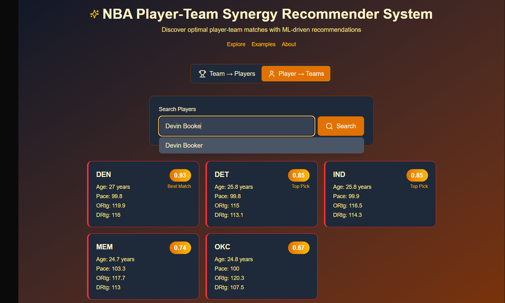
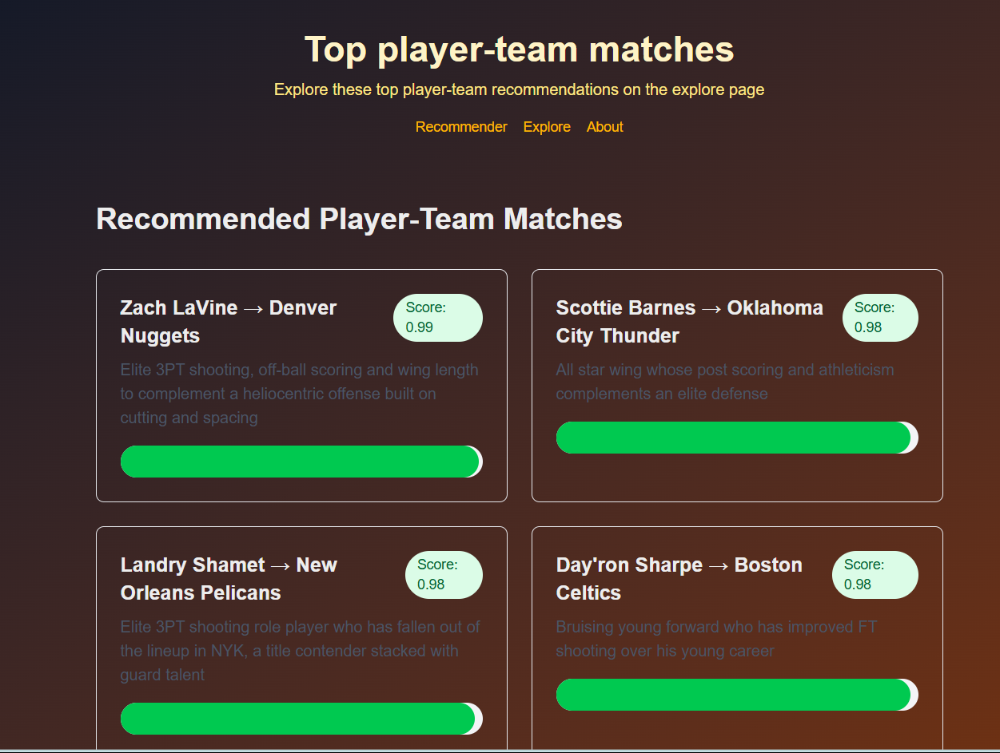
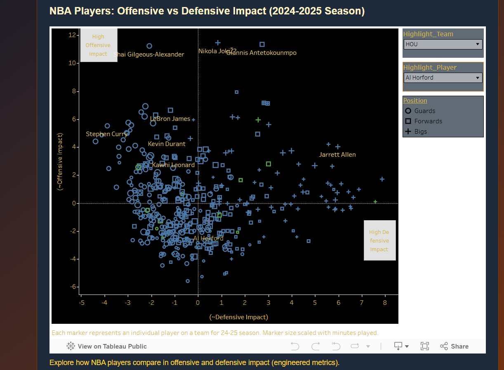

# NBA Player-Team Fit Recommender System  
**A data-driven approach to finding optimal NBA player-team matches**  

** Live Demo: [https://nbarecommender.vercel.app/recommender](https://nbarecommender.vercel.app/recommender)**  

### Why this exists
Have you ever watched a player and thought: "they would be a great fit on x team. What if they could play with y player." As an NBA fan, I've had endless conversations about the latest trades, free-agent signings, etc. In the emergent era of sports analytics, performance metrics are abundant. From an NBA front-office perspective, there is great potential for data tools to improve performance, but only if the outputs are clear, trustworthy, and integrated into existing workflows.

NBA front-offices or fans shouldn't need to understand PCA and cosine-similarity values; they want insights about their favorite players and teams. This dashboard demonstrates how a recommender system fed by current and robust player statistics can integrate into a simple, interpretable tool for assisting decision-making processes.

## About
This recommender system uses machine learning and a heuristic-based recommender derived from vectorized counting and advanced statistics for the 2024-2025 NBA season (BBallRef) to identify player-team matches based on performance data and playing styles.

## Model
- The model accounts for 68 raw metrics (37 team statistics and 31 individual player statistics) including shooting percentages, counting stats, defensive impact, and pace compatibility along with 10 engineered features. 
- Each recommendation receives a score from 0 (least compatible) to 1 (most compatible) indicating the predicted synergy level.
- Data sourced from [Basketball-Reference](https://www.basketball-reference.com/)  

##  Key Features  

### 1. Interactive Recommender  

<div align="center">
  
</div>
 
*Example: "Show me teams which fit Devin Booker's playstyle"*  

### 2. Strong player-team alignment examples
<div align="center">
  
</div>
 
*Example: "Why Zach Lavine fits the Nuggets → Elite wing scoring + secondary ball handling + defensive versatility"*  

### 3. Interactive Statistical Visualizer
<div align="center">
  
</div>
- Offensive and Defensive impact visualized per player and for players on a team
- Tableau's JS API was used to embed visualizations directly into the react explore page.

## Technology Stack  
| Component       | Technology               | Hosting  |
|-----------------|--------------------------|----------|
| Frontend        | React.js         | Vercel   |
| Backend         | FastAPI                  | Render   |
| Database        | PostgreSQL (Neon)        | Neon     |
| Data Pipeline   | pandas, sklearn           | -        |

## How It Works  
1. **Data Pipeline**: Web scraping → feature engineering  
2. **Recommender**: Cosine similarity on 68-dimensional feature space  
3. **Ranking**: Adjusts for playstyle compatibility + player productivity

##  Deployment  
```bash
# Local setup
git clone https://github.com/yourusername/nba-recommender.git
cd nba-recommender
pip install -r backend/requirements.txt
npm install --prefix frontend
```

** Live Demo: [https://nbarecommender.vercel.app/recommender](https://nbarecommender.vercel.app/recommender)**  

##  Future
- Salary cap + player contract consideration
- Lineup analysis
