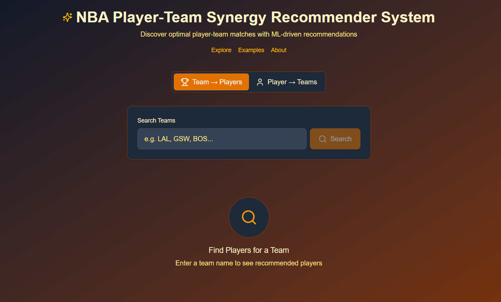

# NBA Player-Team Fit Recommender System  
**A data-driven approach to finding optimal NBA player-team matches**  

** Live Demo: [https://nbarecommender.vercel.app/recommender](https://nbarecommender.vercel.app/recommender)**  

![App Screenshots]  
*Example: Homepage (left), Recommender (center), Visualizations (right)*  



## Overview  
This system suggests optimal NBA player-team fits using:  
- **37 player metrics** (counting stats, advanced metrics, engineered features)  
- **31 team metrics** (counting stats, advanced metrics, engineered features)
- Data sourced from [Basketball-Reference](https://www.basketball-reference.com/)  

##  Key Features  

### 1. Interactive Recommender  
  
*Example: "Show me players who fit the current Laker's roster"*  

### 2. Strong player-team alignment examples
  
*Example: "Why Zach Lavine fits the Nuggets → Elite wing scoring + secondary ball handling + defensive versatility"*  

### 3. Statistical Visualizer
Tableau's JS API was used to embed visualizations directly into the react explore page.
  
*Offensive and Defensive impact visualized per player vs players on a team*  

## Technology Stack  
| Component       | Technology               | Hosting  |
|-----------------|--------------------------|----------|
| Frontend        | React.js         | Vercel   |
| Backend         | FastAPI                  | Render   |
| Database        | PostgreSQL (Neon)        | Neon     |
| Data Pipeline   | pandas, sklearn           | -        |

## How It Works  
1. **Data Pipeline**: Web scraping → feature engineering  
2. **Recommender**: Cosine similarity on 68-dimensional feature space  
3. **Ranking**: Adjusts for playstyle compatibility + player productivity

##  Deployment  
```bash
# Local setup
git clone https://github.com/yourusername/nba-recommender.git
cd nba-recommender
pip install -r backend/requirements.txt
npm install --prefix frontend

** Live Demo: [https://nbarecommender.vercel.app/recommender](https://nbarecommender.vercel.app/recommender)**  

##  Future
- Salary cap + player contract consideration
- Lineup analysis
